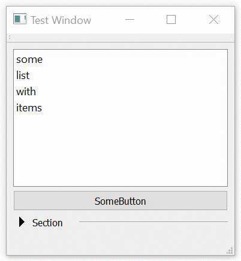

# QT: Collapsible Section

This is a simple collapsable section for QT. It has been tested with QT5.6.

Special thanks to "x squared" who has posted the original code for this idea at StackOverflow: http://stackoverflow.com/a/37119983/2573127

A python version is available, using PyQt5 or PySide6, as Section.py.

## Sample Code

    Section* section = new Section("Section", 300, parentWidget);
    auto* anyLayout = new QVBoxLayout();
    anyLayout->addWidget(new QLabel("Some Text in Section", section));
    anyLayout->addWidget(new QPushButton("Button in Section", section));

    section->setContentLayout(*anyLayout);

## Sample Animation

